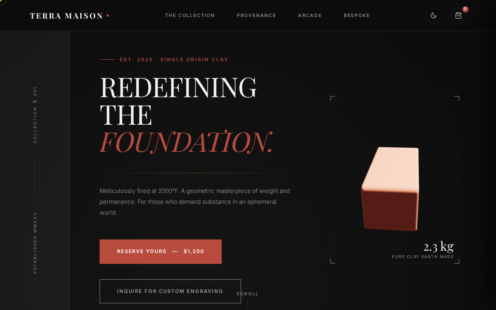
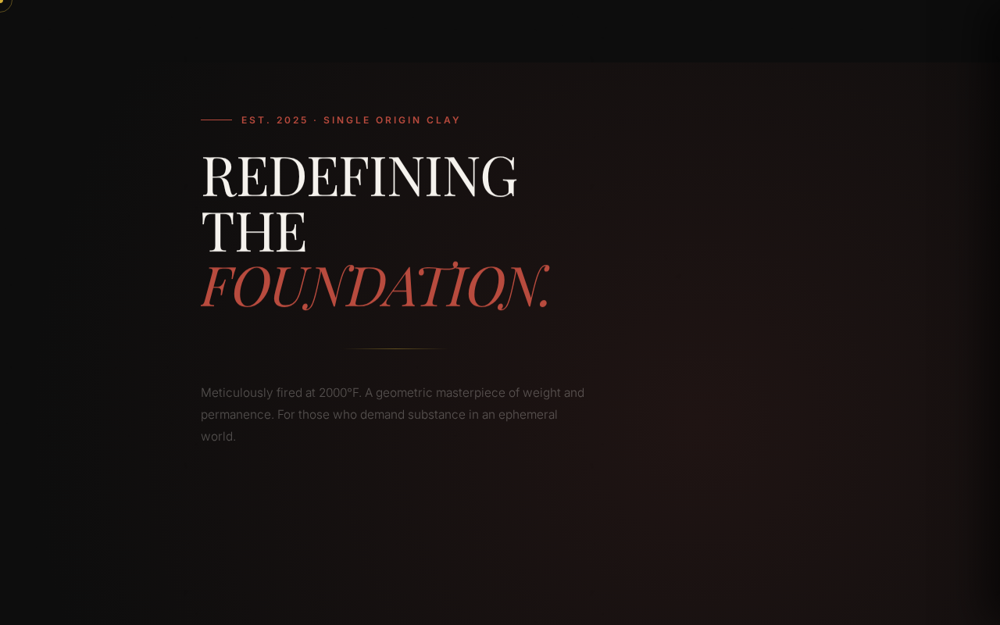

# TERRA MAISON — THE BRICK™ 🧱

<div align="center">
  
  <br>
  <p><strong>Redefining the Foundation through raw physicality and heavy contemplation.</strong></p>
</div>

---

<div align="center">


</div>

## 📸 Demo

Experience the weight of substance: 🔗 [**Live Demo**](https://emon49.github.io/TERRA_MAISON-THE_BRICK/)

<div align="center">
  <video src="assets/screenshots/demo.webm" width="80%" autoplay loop muted></video>
  <br>
  
</div>

## 🚀 About

**TERRA MAISON — THE BRICK™** is a luxury-themed single-page web experience that challenges the digital status quo. It presents a single art object—a hand-fired clay brick—as a monument of permanence in an ephemeral world. This project was born from a desire to blend minimalist luxury design with interactive web technologies, creating a portfolio-ready experience that stands out through its unique concept and meticulous execution.

The inspiration comes from the intersection of ancestral craftsmanship and modern digital interactivity. It's not just a landing page; it's a statement on the beauty of silence and substance, featuring a custom-built arcade game "BRICK POP" as a reward for those who seek to grounded themselves in the physical world.

Built as a personal pet project, it explores high-end UI/UX patterns typically found in premium e-commerce and gallery sites, pushing the boundaries of what a "simple" object can represent when framed through quality code and design.

## ✨ Features

- **🧱 Interactive 3D Showcase**: Powered by Three.js, allowing users to inspect the physical geometry of THE BRICK™ from every angle with OrbitControls.
- **🎭 Cinematic Storytelling**: Smooth momentum scrolling with **Lenis** and refined typographic reveals powered by **GSAP ScrollTrigger**.
- **🎮 BRICK POP Mini-game**: A fully functional, synthesized audio-visual arcade experience built with **Web Audio API** and custom Canvas 2D logic.
- **🛍️ Bespoke E-commerce Flow**: A curated portfolio (cart) system, custom engraving inquiry modal, and a simulated high-end checkout process.
- **🌓 Dual-Theme Luxury**: Seamlessly switch between Dark and Light modes with persistent user preferences and an anti-flash theme script.
- **📱 Responsive Mastery**: Meticulously crafted layouts for everything from mobile devices with custom touch controls to ultra-wide desktop displays.

## 🛠️ Tech Stack

| Technology | Usage |
| --- | --- |
| **React 19** | Component architecture and state management |
| **Three.js** | Interactive 3D rendering and WebGL scenes |
| **GSAP** | Professional-grade UI transitions and scroll-driven animations |
| **Lenis** | Buttery smooth momentum scrolling |
| **Tailwind CSS v4** | Modern utility-first styling and high-contrast design |
| **Web Audio API** | Real-time synthesized sound engine for game audio |
| **Vite** | Blazing-fast development environment and build tooling |

## 🏁 Getting Started

### Prerequisites
- A modern web browser (Chrome, Firefox, Safari, or Edge)
- [Node.js](https://nodejs.org/) (v18 or higher recommended)
- [Git](https://git-scm.com/)

### Installation
1. Clone the repository:
   ```bash
   git clone https://github.com/emon49/TERRA_MAISON-THE_BRICK.git
   ```
2. Navigate into the project directory:
   ```bash
   cd TERRA_MAISON-THE_BRICK
   ```
3. Install dependencies:
   ```bash
   npm install
   ```

### Running Locally
To start the development server:
```bash
npm run dev
```
Open your browser and navigate to `http://localhost:3000` to view the site.

## 📂 Project Structure

```text
TERRA_MAISON-THE_BRICK/
├── assets/             # Visual assets and screenshots
├── src/
│   ├── assets/         # Source images and models
│   ├── App.tsx         # Main application logic (currently minimalist)
│   ├── index.css       # Global styles and Tailwind imports
│   └── main.tsx        # React entry point
├── index.html          # Central application core and layout
├── vite.config.ts      # Vite configuration
└── package.json        # Dependencies and scripts
```

## 🗺️ Roadmap

- [ ] **AR Integration**: Allow users to view THE BRICK™ in their own space using WebXR.
- [ ] **Enhanced Personalization**: Real-time 3D rendering of custom engravings.
- [ ] **Multi-item Collection**: Introducing "The Mortar" and "The Trowel" as future releases.
- [ ] **Persistent Global High Scores**: Backend integration for the BRICK POP mini-game.

## 🤝 Contributing

Contributions, issues, and feature requests are welcome! Feel free to check the [issues page](https://github.com/emon49/TERRA_MAISON-THE_BRICK/issues). Since this is a personal project, keep things friendly and approachable.

## 👤 Author

**emon49**
- GitHub: [@emon49](https://github.com/emon49)
- LinkedIn: [Emon Hossain](https://www.linkedin.com/in/emon0/)

## 📜 Acknowledgments

- **Grameenphone Academy** for the foundational guidance and support.
- **Ashraful Alam** for the inspiring `Zero Code App @ Vibe Coding` tutorial.
- **AI Tools**: Crafted with the assistance of **Google AI Studio** and **Jules Coding Agent**.

---

<div align="right">
  <a href="#terra-maison--the-brick-">Back to Top ↑</a>
</div>
